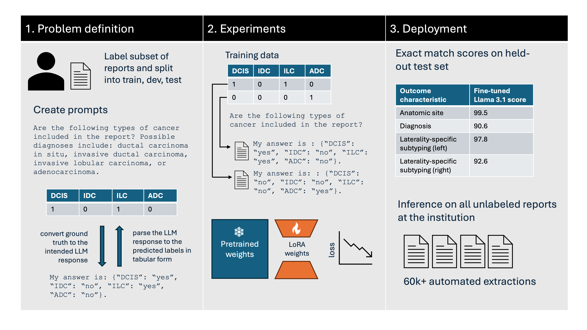

# Strata: human-level information extraction from clinical reports with fine-tuned language models



### By Joy Liu  and Tony Lian   

Strata is an open-source, low-code library designed to streamline the fine-tuning, evaluation, and deployment of large language models (LLMs) for extracting structured data from free-text clinical reports. It enables researchers to easily customize LLMs for clinical information extraction, reducing the need for extensive manual annotation. Strata supports local model hosting, ensuring privacy, reproducibility, and control over model versions. By simplifying the customization process and requiring minimal computational resources, Strata accelerates the development of AI tools for clinical research, making it more accessible to users with limited technical expertise. Strata leverages the [Hugging Face Transformers](https://huggingface.co/transformers/) library and [unsloth](https://unsloth.ai/) library for implementations of LLMs and efficient fine-tuning.

### Table of contents
* [**Installation**](#installation)
* [**Development**](#development)
* [**Problem Definition**](#problem-definition)
    * [Data Preprocessing](#data-preprocessing)
    * [Prompt Creation](#prompt-creation)
    * [Template and Parsing Script](#template-and-parsing-script)
* [**Experiments**](#experiments)
    * [Zero-Shot](#zero-shot)
    * [Fine-tuning](#fine-tuning)
    * [Sweeps](#sweeps)
* [**Deployment**](#deployment)
    * [Evaluation](#evaluation)
    * [Inference](#inference)
* [**Example**](#example)

## Installation
### Docker
Please ensure your docker has GPU support ([Docker installation guide](https://docs.nvidia.com/datacenter/cloud-native/container-toolkit/latest/install-guide.html)). We recommend using [rootless docker](https://docs.docker.com/engine/security/rootless/) for security.
```sh
docker build --build-arg http_proxy="${http_proxy}" --build-arg https_proxy="${https_proxy}" --build-arg no_proxy="${no_proxy}" -t strata:0.1 .
docker run -it --rm -e http_proxy="${http_proxy}" -e https_proxy="${https_proxy}" -e no_proxy="${no_proxy}" -v .:/root/strata --gpus all strata:0.1
# Then you can run train/inference commands
```
If you want to use docker for development, it is advised to mount a clone of this repo into the docker so that updates outside can be reflected inside of the docker container (through `-v .:/root/strata` added above).

### Conda
You need to install [Miniconda](https://docs.anaconda.com/miniconda/miniconda-install/) first and then run the command.
```sh
# Ensure you are in the clone of this repo
source ./setup_conda.sh
# Every time you log in, please switch to strata env
conda activate strata
# Then you can run train/inference commands
```

## Development
Install the package as an editable package and install pre-commit to develop.

```sh
pip install -e . -v
pip install pre-commit
# Initialize pre-commit
pre-commit install
```

## Problem Definition 
### Data Preprocessing

Strata supports data in the CSV and JSON formats. We've created an illustrative example dataset, with versions in both formats. Please note that all data is **synthetic**, for the **sole purpose** of demonstrating how to use Strata. 

#### CSV
Please preprocess your data into CSV format and include only the following columns: `"Accession Number"`, `"Report Text"`, and ground truth values (inference will run without ground truth labels, but they are required for training and evaluation). 
```
Accession Number | Report Text | Source_RB | Source_LB | Cancer_RB | Cancer_LB
-----------------|-------------|-----------|-----------|-----------|-----------
     985440      |     ...     |     1     |     0     |     1     |     0
     503958      |     ...     |     1     |     1     |     0     |     1
     894772      |     ...     |     0     |     0     |     0     |     0
```

In addition to the accession numbers and report texts, we have ground truth labels for two tasks: tissue source and cancer diagnosis. The tissue source can be any combination of left breast and right breast. In the columns `Source_LB` and `Source_RB`, the value is `1` if the tissue is examined and `0` if it is absent. In the columns `Cancer_LB` and `Cancer_RB`, the value is `1` if a tissue source is examined and cancer is deterministically diagnosed and `0` otherwise.

You can reference additional synthetic example data at [train_0.8_0.1_0.1_0.csv](example_data/train_0.8_0.1_0.1_0.csv). 

#### JSON 
Similarly to CSV, the JSON should contain `"Accession Number"`, `"Report Text"`, and ground truth values. Here is the equivalent of the above example in JSON, where if a tissue source is not investigated we exclude it from the cancer diagnosis:
```
[
    {
        "Accession Number": 985440,
        "Report Text": ...,
        "Cancer_Diagnosis": "{\"Right Breast\": 1}"
    },
    {
        "Accession Number": 503958,
        "Report Text": ...,
        "Cancer_Diagnosis": "{\"Right Breast\": 0, \"Left Breast\": 1}"
    },
    {
        "Accession Number": 894772,
        "Report Text": ...,
        "Cancer_Diagnosis": "{}"
    }
]
```
You can reference additional synthetic example data at [train_0.8_0.1_0.1_0.json](example_data/train_0.8_0.1_0.1_0.json)

#### Splits 
The following script may be used to split data into training, validation, and test sets: [split_data.py](scripts/split_data.py), with bash command [run_split.sh](scripts/run_split.sh). 

### Prompt Creation
In the dataset above, we care about two tasks: the tissue source and the cancer diagnosis associated with each report text. Each task should be defined by i) a question to the model, ii) the corresponding ground truth labels, which can be in any number of columns, and iii) parse functions, which convert the ground truth labels to the intended LLM response and vice versa. The template file should be formatted as follows: 
```yaml
name # each question should have a unique identifier 
  question: # the text of the question itself 
  gt_columns: # the column names 
  parse_response: # the path to the parse function
  question_name: # question name used for formatting
  response_start: # optional, defaults to "My answer is:"
  preamble: # optional, defaults to "You are an experienced pathologist. Answer the question using the pathology report below. Base the answer on the report only. Do not add any additional information."
```

Each row in the data will be mapped into a prompt framework which consists of two roles, a user and an assistant. The question field and the value of `"Report Text"` will be inserted into the prompt framework as part of what the user says: 
```
{preamble}

{report}

{question}   
```
The assistant responds to the user’s question. This always begins with the `response_start`.  During fine-tuning, the response includes the ground truth. During inference, the model is prompted to complete the response with label it predicts. 

Example [CSV](configs/example/templates.yaml) and [JSON](configs/example/templates_json.yaml) templates are provided in this repo. You can download it and modify for your application. 

### Template and Parsing Script 
The `parse_response` file should contain two methods: the template, `gt_to_response`, and the parsing script, `parse_response`. During training, the output of the template is added to the assistant's response after `response_start`. During inference, the generated prediction is passed into the parsing script. You can reference an example here, which is used for the `source` question in the CSV data: [parse_functions/example/source.py](parse_functions/example/source.py).

In the example, the template `gt_to_response({"Source_RB": 1, "Source_LB": 0})` will output `"right breast"`.
```python
def gt_to_response(gt):
  """
  Args:
    gt (dict): a dictionary with (gt column, gt value) pairs from one row in the data  
  Returns:
    str: the intended response for the LLM
  """
```

In the example, the parsing script `parse_response("My answer is: right breast", "My answer is:")` will output  `{"Source_RB": 1, "Source_LB": 0}`. 
```python
def parse_response(response, response_start):
  """
  Args:
    response (str): the raw LLM response in its entirety
    response_start (str): the prefix to the response, to be removed from response
  Outputs 
    dict: a dictionary with (gt column, gt value) pairs from one row in the data
  """
```

For JSON data, the [default parse function](parse_functions/example/default.py) can be used to to predict any field directly.

## Experiments

[Unsloth](https://github.com/unslothai/unsloth) library supports fine-tuning numerous LLMs, which we also support. We have tested the codebase on the following models:
- [mistralai/Mistral-7B-Instruct-v0.3](https://huggingface.co/mistralai/Mistral-7B-Instruct-v0.3)
- [meta-llama/Llama-3-8B-Instruct](https://huggingface.co/meta-llama/Meta-Llama-3-8B-Instruct)
- [meta-llama/Llama-3.1-8B-Instruct](https://huggingface.co/meta-llama/Llama-3.1-8B-Instruct)

An [example config](configs/example/llama3.1-8b.yaml) shows how to set the data paths, the model architecture, and the training and inference settings. 

### Zero-Shot 
In `test` mode, the library predicts the labels and evaluates the predictions against ground truth values at `args.data.val_set_data_path`, logging the overall accuracy and the question accuracies. `args.save_path` defaults to `outputs/` and `args.exp_name` defaults to `example/llama3.1-8b`, so the outputs will be saved at `outputs/example/llama3.1-8b`.
```sh
python -m strata.main test configs/example/llama3.1-8b.yaml --inference-mode zero-shot 
```

Four files will be saved at `outputs/example/llama3.1-8b`: `inference.csv` contains the predicted responses of the model, `eval.csv` contains the comparisons with the ground truth labels, and `scores.csv` and `scores_per_column.csv` contain the evaluation metrics per question and per column respectively.

If the ground truth labels are not known, `inference` mode should be used. The library will only generate the predictions for the report texts at `args.data.val_set_data_path`.
```sh
python -m strata.main inference configs/example/llama3.1-8b.yaml --inference-mode zero-shot 
```

Please check the `inference.csv` for inference outputs at `outputs/example/llama3.1-8b`.

### Fine-tuning 
  
To fine-tune the model on the dataset at `args.data.train_set_data_path`, run the following command. You will be prompted to log-in to WandB, which will track the training loss. The model checkpoint will be saved at `outputs/example/llama3.1-8b-ft`. 

```sh
python -m strata.main train configs/example/llama3.1-8b.yaml --opts exp_name example/llama3.1-8b-ft
```
Questions to be included in fine-tuning can be selected in `args.data.questions`. 

Using the same config, the library will load the fine-tuned model checkpoint and evaluate the accuracy on `args.data.val_set_data_path`. 
```sh
python -m strata.main test configs/example/llama3.1-8b.yaml --inference-mode fine-tuned --opts exp_name example/llama3.1-8b-ft
```
As in zero-shot, four files will be saved at `outputs/example/llama3.1-8b-ft`: `inference.csv` contains the predicted responses of the model, `eval.csv` contains the comparisons with the ground truth labels, and `scores.csv` and `scores_per_column.csv` contain the evaluation metrics per question and per column respectively.

### Sweeps 
You can loop through hyperparameters using a bash loop. Here is an example that sweeps through the learning rate:
```bash
for lr in 0.001 0.0001 0.00001
do
python -m strata.main train configs/example/llama3.1-8b.yaml --opts trainer.learning_rate $lr exp_name example/llama3.1-8b-ft-lr$lr
done
```

## Deployment

### Using test set instead of validation set
Set `use_test_set` in the config to True. The library will generate the predictions for the report texts at `args.data.test_set_data_path`, and the saved csvs will have suffix `_test_set`.

### Evaluation
By default Strata will calculate the exact match, F1, precision, and recall scores. The function should be defined according to the following docstring: 

```python
def metric(gt_column, pred_column, inference_results_df):
    """
    Args:
        gt_column (str): the column containing the ground truth labels 
        pred_column (str): the column containing the predicted labels
        inference_results_df (pandas.DataFrame): the DataFrame at inference.csv, which contains the predicted labels and the ground truth labels 
    Outputs 
        float: the value of the metric for gt_column and pred_column
    """
```

Here is an example of a function that calculates mean squared error:
```python
from sklearn.metrics import mean_squared_error

def MSE(gt_column, pred_column, inference_results_df):
    # Identify rows with ground truth labels
    keep_if_labeled = ~inference_results_df[gt_column].isna()
    # Filter for rows with labels
    gt = inference_results_df[gt_column][keep_if_labeled]
    pred = inference_results_df[pred_column][keep_if_labeled]
    # Calculate mean squared error using the scikit-learn library
    return mean_squared_error(gt, pred)
```

Custom metrics can be added to [metrics.py](src/strata/utils/metrics.py), which also contains the default metrics for reference. The metrics specified in the [config](configs/example/llama3.1-8b.yaml#L38) will be calculated for the predictions.

### Inference 
To predict the labels for the test set when the ground truth is unknown, `inference` mode and `use_test_set` should be used. The library will generate the predictions for the report texts at `args.data.test_set_data_path`, saving them under `args.save_path`.
```sh
python -m strata.main inference configs/example/llama3.1-8b.yaml --inference-mode fine-tuned --opts exp_name example/llama3.1-8b-ft use_test_set True 
```

## Examples

### CSV
Let's fine-tune on [toy data](example_data/) using the CSV [example config](configs/example/llama3.1-8b.yaml) and [template](configs/example/templates.yaml) to improve the performance of the model. 

First, benchmark zero shot inference: 
```sh
python -m strata.main test configs/example/llama3.1-8b.yaml --inference-mode zero-shot
```

This should yield the following results: 
```
  Question  All Correct     F1  Precision  Recall
0   source        100.0  100.0      100.0   100.0
1   cancer         30.0   41.7       75.0    29.2
2  overall         30.0   70.8       87.5    64.6
Note: for 'All Correct', the 'overall' metric is exact match over all questions. For other columns, the metric is averaged over questions.

    Question Category  All Correct     F1  Precision  Recall
0  Source_LB   source        100.0  100.0      100.0   100.0
1  Source_RB   source        100.0  100.0      100.0   100.0
2  Cancer_LB   cancer         50.0   33.3       50.0    25.0
3  Cancer_RB   cancer         80.0   50.0      100.0    33.3
```

The output for the first question is perfect, but the output for the second question is not perfect because the model, without fine-tuning on our medical dataset, cannot capture some nuances in the data.

Next, try fine-tuning the model: 
```sh
python -m strata.main train configs/example/llama3.1-8b.yaml --opts exp_name example/llama3.1-8b-ft
```

Finally, try the new checkpoint on the val set. It should take a few minutes to run.
```sh
python -m strata.main test configs/example/llama3.1-8b.yaml --inference-mode fine-tuned --opts exp_name example/llama3.1-8b-ft
```

The results should now be:
```
  Question  All Correct     F1  Precision  Recall
0   source        100.0  100.0      100.0   100.0
1   cancer        100.0  100.0      100.0   100.0
2  overall        100.0  100.0      100.0   100.0
Note: for 'All Correct', the 'overall' metric is exact match over all questions. For other columns, the metric is averaged over questions.

    Question Category  All Correct     F1  Precision  Recall
0  Source_LB   source        100.0  100.0      100.0   100.0
1  Source_RB   source        100.0  100.0      100.0   100.0
2  Cancer_LB   cancer        100.0  100.0      100.0   100.0
3  Cancer_RB   cancer        100.0  100.0      100.0   100.0
```

The model now has perfect accuracy on the val set, indicating that the fine-tuning process greatly improved the model's performance.

### JSON 
Let's fine-tune on [toy data](example_data/) using the JSON [example config](configs/example/llama3.1-8b_json.yaml) and [template](configs/example/templates_json.yaml) to improve the perfomance of the model. 

First, benchmark zero-shot: 
```sh
python -m strata.main test configs/example/llama3.1-8b_json.yaml --inference-mode zero-shot
```
This should give you 0 percent match. Taking a look at `outputs/example/llama3.1-8b-json/inference.csv`, it seems like the model always outputs both lateralities. You could consider developing a more fine-grained evaluation metric according to [Evaluation](#evaluation), or you could fine-tune to help the model understand the prompt better. 

Here's the command for fine-tuning:
```sh 
python -m strata.main train configs/example/llama3.1-8b_json.yaml --opts exp_name example/llama3.1-8b-ft_json
```

Finally, test out the fine-tuned model: 
```sh
python -m strata.main test configs/example/llama3.1-8b_json.yaml --inference-mode fine-tuned --opts exp_name example/llama3.1-8b-ft_json
```

The model now has perfect accuracy on the val set, indicating that the fine-tuning process greatly improved the model's performance:
```
  Question  All Correct     F1  Precision  Recall
0   cancer        100.0  100.0      100.0   100.0
1  overall        100.0  100.0      100.0   100.0
Note: for 'All Correct', the 'overall' metric is exact match over all questions. For other columns, the metric is averaged over questions.

           Question Category  All Correct     F1  Precision  Recall
0  Cancer_Diagnosis   cancer        100.0  100.0      100.0   100.0
```
